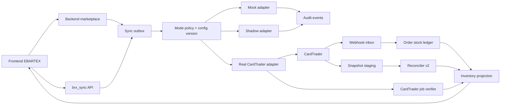

# Piano di messa in sicurezza e correzione della sincronizzazione CardTrader

> Stato: piano tecnico, nessuna implementazione inclusa  
> Ambito: `brx_sync`, backend marketplace e `new_frontend_brx`  
> Obiettivo: eliminare oggetti duplicati, mancanti o obsoleti senza introdurre scritture accidentali su CardTrader

## 1. Obiettivo

Correggere la sincronizzazione dell'inventario garantendo che:

- l'inventario reale EBARTEX rifletta CardTrader in modo verificabile;
- webhook, retry e concorrenza non applichino due volte la stessa variazione;
- gli articoli rimossi o esauriti non restino attivi nel sito;
- gli articoli validi non vengano saltati silenziosamente;
- le modalità `demo`, `partial` e `real` siano isolate e applicate dal backend;
- le modalità di test non possano effettuare scritture su CardTrader;
- ogni operazione reale sia tracciata, verificata e reversibile operativamente;
- il rilascio possa essere interrotto o ripristinato tramite feature flag, senza rollback distruttivi.

## 2. Fuori ambito iniziale

Nelle prime fasi non si deve:

- eliminare immediatamente dati esistenti;
- modificare in massa l'inventario CardTrader;
- riprodurre su CardTrader operazioni simulate in precedenza;
- unificare fisicamente database appartenenti a servizi diversi;
- riscrivere contemporaneamente tutti i flussi frontend e backend;
- utilizzare account CardTrader reali degli utenti per i test iniziali.

## 3. Stato attuale da correggere

### 3.1 Modalità conosciute solo parzialmente dai servizi

Il frontend espone:

- `demo`;
- `partial`;
- `real`.

La configurazione viene gestita attraverso il backend marketplace. `brx_sync`, che possiede il token e il client CardTrader, attualmente non conosce la modalità di esecuzione. Di conseguenza non è in grado di impedire autonomamente una scrittura esterna proveniente da una route o da un task.

La prima correzione deve quindi essere una barriera server-side centralizzata. La UI di conferma non è una misura di sicurezza sufficiente.

### 3.2 Inventario non riconciliato

Il percorso attuale:

- importa e aggiorna i prodotti presenti in `/products/export`;
- non archivia in modo affidabile quelli assenti;
- conserva righe a quantità zero;
- scarta One Piece e mapping mancanti;
- può terminare con successo anche quando alcuni prodotti sono stati saltati;
- usa una riconciliazione periodica non completa e non sufficientemente registrata nel worker.

### 3.3 Webhook senza ledger transazionale

Mancano:

- una inbox idempotente;
- lo storico della quantità già decrementata per ordine e articolo;
- una state machine CardTrader Zero;
- una separazione obbligatoria dei webhook `test`;
- il rifiuto effettivo delle firme non valide;
- una gestione affidabile di `order.destroy`, il cui payload non contiene i dati dell'ordine.

### 3.4 Composizione frontend ambigua

La pagina Oggetti concatena righe Sync e listing marketplace. Senza un collegamento esplicito tra listing EBARTEX e articolo CardTrader, lo stesso stock può essere mostrato due volte. Il conteggio corrente rappresenta inoltre il numero di righe, non necessariamente le unità fisiche disponibili.

## 4. Contratto definitivo delle tre modalità

Il nome API `partial` può essere mantenuto per compatibilità, ma il suo significato deve diventare formalmente **shadow/dry-run**.

| Modalità | Origine dati | GET CardTrader | POST/PUT/DELETE CardTrader | Webhook | Inventario modificabile |
|---|---|---:|---:|---|---|
| `demo` | Fixture ed eventi sintetici | No | Mai | Solo endpoint/eventi demo | Namespace demo |
| `partial` / shadow | Snapshot reali in sola lettura o fixture realistiche | Sì | Mai | Copia in inbox shadow | Proiezione shadow |
| `real` | CardTrader reale | Sì | Sì, tramite outbox verificata | Solo live e firmati | Inventario reale |

### 4.1 Regole non negoziabili

1. `demo` non deve caricare né decifrare il token CardTrader.
2. `partial` può leggere CardTrader, ma non deve disporre di metodi di mutazione utilizzabili.
3. Solo `real` può inviare mutazioni esterne.
4. Nessun task può fidarsi esclusivamente della modalità ricevuta nel payload.
5. Ogni task deve ricontrollare modalità e versione della configurazione subito prima della scrittura.
6. I dati `demo`, `shadow` e `real` devono essere separati tramite namespace/colonne e chiavi univoche.
7. Un passaggio a `real` non deve riprodurre automaticamente le azioni simulate in shadow.
8. Un passaggio da `real` a una modalità sicura deve invalidare le operazioni reali ancora in coda.

## 5. Architettura obiettivo



### 5.1 Unica fonte autorevole della modalità

Scelta raccomandata: `brx_sync` deve essere la fonte autorevole perché gestisce credenziali e operazioni CardTrader.

Il backend marketplace può mantenere una copia di lettura, ma:

- non deve poter divergere dalla configurazione autorevole;
- deve ricevere `mode_version` insieme alla modalità;
- deve allegare modalità e versione agli eventi/outbox;
- `brx_sync` deve comunque ricontrollare i valori prima dell'esecuzione.

### 5.2 Gateway unico per CardTrader

Creare un'interfaccia comune, ad esempio `ExternalInventoryAdapter`, con tre implementazioni:

- `MockCardTraderAdapter`:
  - utilizza fixture;
  - simula job e webhook;
  - non effettua traffico verso CardTrader.

- `ShadowCardTraderAdapter`:
  - consente solo operazioni di lettura;
  - trasforma ogni mutazione in un `dry_run_event`;
  - restituisce un esito simulato chiaramente marcato;
  - non deve contenere metodi HTTP di scrittura raggiungibili.

- `RealCardTraderAdapter`:
  - usa il token reale;
  - applica rate limit, timeout e circuit breaker;
  - registra command ID e job UUID;
  - considera riuscita una mutazione solo dopo verifica terminale.

Nessuna route o task deve chiamare direttamente metodi CardTrader di scrittura al di fuori del gateway.

### 5.3 Separazione delle code

Code raccomandate:

- `sync-demo`;
- `sync-shadow`;
- `sync-real`;
- `sync-webhooks`;
- `sync-reconcile`.

Solo il worker `sync-real` deve poter utilizzare il real adapter. Se l'infrastruttura lo consente, il worker shadow deve avere una policy di rete che impedisca richieste non-GET verso CardTrader.

## 6. Modello dati additivo

Le migrazioni iniziali devono essere additive e compatibili con il codice esistente.

### 6.1 Profilo di sincronizzazione

Estendere `user_sync_settings` con:

- `execution_mode`: `demo | shadow | real`;
- `mode_version`: intero incrementale;
- `writes_enabled`: kill switch per utente;
- `mode_changed_at`;
- `last_complete_snapshot_id`;
- `last_reconciliation_at`;
- `reconciliation_status`;
- `config_version`.

### 6.2 Articoli inventario

Estendere o migrare progressivamente `user_inventory_items` con:

- `source`: `cardtrader | marketplace | mock | legacy_unknown`;
- `environment`: `demo | shadow | real`;
- `provider_product_id`;
- `provider_blueprint_id`;
- `catalog_print_id`;
- `marketplace_listing_id`;
- `quantity`;
- `bundle_size`;
- `bundled_quantity`;
- `lifecycle_status`: `active | sold_out | stale | archived | sync_failed`;
- `mapping_status`: `mapped | unsupported | missing | error`;
- `last_seen_snapshot_id`;
- `missing_snapshot_count`;
- `row_version`;
- `last_external_update_at`;
- `last_local_update_at`.

Vincolo univoco raccomandato:

```text
(user_id, source, environment, provider_product_id)
```

L'ID blueprint CardTrader e l'ID stampa/catalogo EBARTEX non devono più condividere lo stesso significato o la stessa colonna.

### 6.3 Tabelle operative

#### `sync_snapshots`

Registra:

- utente, provider e ambiente;
- data inizio/fine;
- numero prodotti ricevuti;
- checksum/identificatore snapshot;
- stato `fetching | validating | complete | rejected | applied`;
- motivazione di un eventuale rifiuto;
- conteggio created/updated/stale/archived/skipped.

#### `webhook_inbox`

Registra:

- provider;
- webhook ID;
- object ID;
- causa;
- modalità webhook `test | live`;
- firma valida/non valida;
- payload originale;
- stato elaborazione;
- numero tentativi;
- errore finale.

Vincolo univoco:

```text
(provider, webhook_id)
```

#### `order_stock_ledger`

Registra per ordine e articolo:

- ordine CardTrader;
- product ID;
- quantità venduta;
- delta applicato;
- stato sorgente;
- `via_cardtrader_zero`;
- decremento applicato sì/no;
- ripristino applicato sì/no;
- ultimo webhook processato;
- versione riga.

#### `sync_outbox`

Registra:

- command ID interno;
- utente e modalità;
- `mode_version`/`config_version`;
- tipo operazione;
- target product ID;
- payload desiderato;
- stato `pending | running | accepted | verified | failed | uncertain | cancelled`;
- job UUID CardTrader;
- tentativi;
- risultato e warning esterni.

#### `sync_audit_events`

Registra ogni variazione con:

- prima/dopo;
- origine;
- modalità;
- command/webhook/snapshot ID;
- utente tecnico o processo;
- timestamp;
- motivazione.

## 7. Fasi di implementazione

## Fase 0 — Audit completo dei punti di scrittura

### Attività

1. Ottenere accesso al backend marketplace che implementa `/sync/mode`, `/sync/trigger` e i listing.
2. Elencare tutte le chiamate CardTrader nei tre repository.
3. Classificarle come:
   - read;
   - create;
   - update;
   - increment/decrement;
   - delete;
   - job polling;
   - webhook handling.
4. Costruire una matrice endpoint/task × modalità.
5. Identificare task in-flight e operazioni che sopravvivono al cambio modalità.

### Deliverable

Una lista firmata dei soli punti autorizzati a effettuare scritture reali.

### Gate

Non iniziare il refactor dei dati finché ogni scrittura non passa dal gateway o non è coperta da un feature flag fail-closed.

## Fase 1 — Barriera di sicurezza

### Attività

1. Aggiungere modalità e versione a `brx_sync`.
2. Implementare il gateway con adapter mock, shadow e real.
3. Aggiungere kill switch globale e per utente.
4. Registrare ogni tentativo di mutazione bloccato.
5. Instradare i task nelle code separate.
6. Aggiungere un controllo architetturale/test che fallisca se compare una chiamata CardTrader di scrittura fuori dal gateway.
7. Definire il comportamento dei cambi modalità:
   - `real -> shadow/demo`: cancellare i pending non iniziati;
   - task già accettati da CardTrader: stato `uncertain`, poi riconciliazione;
   - `shadow/demo -> real`: non riprodurre eventi simulati;
   - richiedere snapshot completa prima di abilitare nuove scritture reali.

### Deliverable

Garanzia tecnica che demo e shadow non possano modificare CardTrader.

### Gate

Test automatici con conteggio chiamate esterne:

- demo: zero chiamate CardTrader;
- shadow: zero richieste POST/PUT/PATCH/DELETE;
- real: scritture consentite soltanto con feature flag e profilo coerente.

## Fase 2 — Migrazione dati additiva

### Attività

1. Creare le nuove colonne e tabelle senza rimuovere quelle esistenti.
2. Backfill prudente:
   - `external_stock_id` presente -> candidato `source=cardtrader`;
   - listing marketplace -> collegamento tramite `cardtrader_article_id`;
   - dati non classificabili -> `legacy_unknown`;
   - nessun hard delete.
3. Aggiungere indici e vincoli univoci dopo il report dei duplicati.
4. Non assegnare automaticamente `environment=real` a righe ambigue.
5. Produrre report di backfill e collisioni.

### Deliverable

Schema pronto per v2, ancora compatibile con il percorso legacy.

### Gate

Migrazione verificata su copia del database e rollback applicativo tramite feature flag.

## Fase 3 — Reconciler v2 in report-only

### Algoritmo

1. Acquisire lock distribuito su:

   ```text
   user_id + provider + environment
   ```

2. Creare una riga `sync_snapshots` in stato `fetching`.
3. Scaricare `/products/export` in staging.
4. Validare:
   - risposta HTTP completa;
   - parsing completo;
   - product ID presenti e univoci;
   - conteggio plausibile rispetto alla snapshot precedente;
   - quantità non negative;
   - `bundle_size` valido;
   - assenza di errori di mapping sistemici;
   - nessun timeout o circuito aperto.
5. Se la snapshot non è affidabile:
   - stato `rejected`;
   - nessun articolo marcato stale/archived;
   - nessuna mutazione reale.
6. Se completa:
   - confrontare staging e inventario tramite `provider_product_id`;
   - calcolare create/update/sold_out/stale;
   - produrre solo un report diff nella prima fase.
7. Ripetere per più cicli e confrontare v1/v2.

### Regole di assenza

- Prima snapshot completa in cui manca un articolo: `stale`, `missing_snapshot_count=1`.
- Seconda snapshot completa consecutiva: candidato `archived`.
- Snapshot rifiutata: non incrementa il contatore.
- Mapping mancante: articolo conservato come `mapping_status=missing`, non eliminato e non nascosto dai report.

### Deliverable

Diff affidabile tra CardTrader e database senza modificare né CardTrader né la proiezione pubblica.

### Gate

Almeno due snapshot complete consecutive con diff stabile per gli account canary.

## Fase 4 — Applicazione del reconciler v2

### Attività

1. Abilitare l'applicazione soltanto per utenti canary.
2. Upsert degli articoli presenti.
3. Stato `sold_out` per quantità zero.
4. Stato `stale`/`archived` secondo la regola delle due snapshot.
5. Nessun hard delete automatico nella prima release.
6. Aggiornare `last_seen_snapshot_id` e audit nella stessa transazione.
7. Correggere la gestione mapping:
   - Magic, Pokémon e sealed espliciti;
   - One Piece abilitato solo dopo test catalogo;
   - fino ad allora `unsupported`, mai skip silenzioso.
8. Correggere il task periodico:
   - registrazione esplicita nel worker;
   - pianificazione configurata;
   - single-flight per utente;
   - stesso algoritmo dell'import manuale.

### Deliverable

Inventario CardTrader locale riconciliato e storicizzato.

### Gate

Per gli account canary, l'insieme degli ID esterni attivi deve coincidere con due export completi consecutivi.

## Fase 5 — Webhook inbox e state machine

### Ingresso webhook

1. Leggere raw body.
2. Verificare la firma.
3. Firma mancante/non valida:
   - non accodare il task;
   - registrare tentativo e metriche;
   - restituire risposta coerente con la policy concordata.
4. Salvare l'evento in `webhook_inbox`.
5. Duplicato sul vincolo univoco: restituire successo idempotente senza riapplicare il delta.
6. `mode=test`:
   - instradare esclusivamente a demo/shadow;
   - vietare modifiche alla proiezione reale.

### State machine ordini

| Evento/stato | Condizione | Azione inventario |
|---|---|---|
| `order.create`, `paid` | `via_cardtrader_zero=false` | Decremento una volta |
| `order.create/update`, `hub_pending` | `via_cardtrader_zero=true` | Decremento una volta |
| Ordine aggregato `paid` | `via_cardtrader_zero=true` | Nessun decremento aggiuntivo |
| `request_for_cancel` | Qualsiasi | Nessun ripristino definitivo |
| `canceled` | Ledger indica decremento applicato | Ripristino una volta |
| `canceled` | Nessun decremento nel ledger | No-op |
| `order.destroy` | Payload dati vuoto | Usare ledger persistito, non il payload |
| Duplicato/fuori ordine | Evento già applicato o stato precedente | No-op idempotente |

### Transazione

Aggiornamento ledger, quantità inventario e stato inbox devono avvenire nella stessa transazione DB, con lock o optimistic version sulla riga articolo.

### Deliverable

Webhook ripetibili senza alterare più volte la quantità.

### Gate

Suite completa di eventi duplicati, fuori ordine, CT Zero e cancellazioni.

## Fase 6 — Outbox e scritture CardTrader verificate

### Aggiornamenti articolo

1. La richiesta utente aggiorna lo stato desiderato locale e crea l'outbox nella stessa transazione.
2. La risposta espone `pending_sync`, non `synced`.
3. Il worker ricontrolla:
   - modalità corrente;
   - `mode_version`;
   - kill switch;
   - versione articolo;
   - presenza external product ID.
4. Solo il real adapter invia il comando.
5. Per le API bulk asincrone:
   - salvare job UUID;
   - interrogare `/jobs/{uuid}`;
   - attendere stato terminale;
   - leggere errori e warning per articolo.
6. `202 Accepted` significa `accepted`, non successo.
7. Timeout con esito incerto:
   - stato `uncertain`;
   - nessun retry cieco;
   - riconciliazione mirata prima di decidere.

### Eliminazioni

1. Impostare tombstone locale `pending_delete`.
2. Inviare delete tramite outbox.
3. Conferma CardTrader:
   - `archived`/soft delete locale;
   - audit conclusivo.
4. Errore:
   - `sync_failed`;
   - articolo recuperabile;
   - nessuna perdita dell'external ID.

### Deliverable

Nessuna UI o API può dichiarare sincronizzato un comando soltanto accettato da CardTrader.

## Fase 7 — Acquisti e concorrenza

### Flusso raccomandato

1. Transazione locale breve:
   - lock/aggiornamento atomico condizionale;
   - prenotazione quantità;
   - ordine `pending_external`;
   - outbox.
2. Worker real:
   - verifica modalità/versione;
   - verifica mirata dello stock CardTrader;
   - usa export filtrato per `blueprint_id`, non l'intero inventario;
   - invia decremento/delete;
   - risolve eventuale timeout con lettura e riconciliazione.
3. Successo:
   - finalizzare prenotazione e vendita.
4. Fallimento certo:
   - rilasciare prenotazione.
5. Esito incerto:
   - bloccare nuove operazioni sull'articolo;
   - riconciliare;
   - non compensare o ripetere alla cieca.

### Regole di concorrenza

- un solo sync completo per utente;
- operazioni articolo serializzate per `provider_product_id`;
- quantità decrementata con condizione `available >= requested`;
- versione articolo incrementale;
- retry Celery sicuri tramite command ID persistito;
- nessun lock DB mantenuto durante chiamate HTTP esterne.

### Deliverable

Due acquisti simultanei non possono lasciare quantità locale maggiore o minore rispetto all'esito esterno verificato.

## Fase 8 — Proiezione e frontend

### Endpoint inventario unificato

Il backend deve restituire righe già correlate con:

- `inventory_item_id`;
- `source`;
- `environment`;
- `provider_product_id`;
- `marketplace_listing_id`;
- `provider_blueprint_id`;
- `catalog_print_id`;
- `quantity`;
- `bundle_size`;
- `bundled_quantity`;
- `lifecycle_status`;
- `sync_status`;
- `last_synced_at`;
- eventuale errore.

### Correzioni frontend

1. Rimuovere la concatenazione cieca Sync + marketplace.
2. Collegare listing e stock tramite ID espliciti.
3. Non deduplicare tramite nome, titolo o solo blueprint.
4. Usare cursor/keyset pagination con ordinamento stabile:

   ```text
   updated_at DESC, id DESC
   ```

5. Invalidare le query React Query dopo snapshot, webhook applicato o job verificato.
6. Separare i contatori:
   - righe prodotto;
   - unità disponibili;
   - unità fisiche (`bundled_quantity`);
   - stale/sold out/errori.
7. Nascondere per default `sold_out` e `archived`, mantenendo un filtro storico.
8. Non mescolare demo/shadow/real senza selezione esplicita.
9. Mostrare badge chiari: Demo, Shadow, Reale, Pending, Errore.
10. Correggere i testi UI della modalità `partial` affinché promettano zero scritture CardTrader.

### Deliverable

La pagina Oggetti rappresenta una proiezione unica e non una somma di fonti indipendenti.

## Fase 9 — Riparazione controllata dei dati esistenti

### Report per utente

Confrontare snapshot CardTrader e DB producendo:

- `cardtrader_only`;
- `local_only`;
- quantity mismatch;
- bundle mismatch;
- duplicati per external ID;
- righe a quantità zero;
- mapping mancante/unsupported;
- listing marketplace non collegato;
- righe legacy ambigue.

### Applicazione

1. Non modificare dati demo/shadow o listing marketplace come effetto collaterale.
2. Correggere solo record classificati `source=cardtrader`.
3. Applicare a batch piccoli e osservabili.
4. Richiedere due snapshot complete prima dell'archiviazione.
5. Conservare prima/dopo in audit.
6. Prevedere ripristino applicativo delle righe archiviate.
7. Non inviare alcuna scrittura CardTrader durante la riparazione della proiezione locale.

## 8. Piano di test

## 8.1 Unit test

- policy modalità e `mode_version`;
- adapter mock/shadow/real;
- mapping blueprint/catalogo;
- confronto snapshot;
- regola due assenze consecutive;
- state machine ordine;
- CT Zero;
- idempotenza inbox/outbox;
- bundle e contatori;
- transizioni modalità con task pendenti.

## 8.2 Integration test

- PostgreSQL reale/container;
- Redis e lock distribuiti;
- Celery con ack tardivo e worker restart;
- webhook duplicati e fuori ordine;
- snapshot completa/incompleta;
- due sync simultanee;
- due acquisti simultanei;
- job CardTrader pending/completed/unprocessable;
- 429 e backoff;
- timeout prima e dopo l'accettazione del comando;
- delete già eseguita/404;
- mapping MySQL assente o temporaneamente indisponibile.

## 8.3 Contract test CardTrader

Utilizzare fixture registrate e anonimizzate per:

- `/products/export`;
- export filtrato per blueprint;
- prodotti con bundle;
- job bulk;
- standard order;
- CT Zero;
- cancellazioni;
- webhook destroy vuoto;
- firma webhook.

## 8.4 Test per modalità

| Scenario | Demo | Shadow | Real |
|---|---|---|---|
| Lettura snapshot | Fixture | GET reale/fixture | GET reale |
| Creazione listing | Simulata | Dry-run | Outbox reale |
| Aggiornamento quantità | Locale demo | Proiezione shadow | Outbox verificata |
| Acquisto | Simulato | Saga simulata | Saga reale |
| Webhook test | Demo | Shadow | Mai inventario reale |
| Webhook live | Ignorato/copiato | Copia shadow | Inbox reale |
| Delete CardTrader | Mai | Dry-run | Confermata e verificata |

## 8.5 Frontend test

- nessun duplicato tra listing e inventario;
- pagina successiva senza salti o ripetizioni;
- conteggi righe/unità/bundle;
- filtri sold out/stale;
- invalidazione query dopo sync;
- cambio modalità e conferma reale;
- UI fail-closed se lo stato modalità non è disponibile;
- impossibilità di rappresentare shadow come reale.

## 8.6 Test architetturali

- ricerca statica di chiamate CardTrader fuori dal gateway;
- test che demo non istanzi il client CardTrader;
- test che shadow non possa importare/eseguire metodi di mutazione;
- test che ogni outbox reale abbia audit e config version;
- test che un task obsoleto venga cancellato dopo cambio modalità.

## 9. Osservabilità

### Metriche

- snapshot complete/rifiutate;
- durata export;
- numero `cardtrader_only` e `local_only`;
- quantity mismatch;
- mapping missing/unsupported;
- webhook ricevuti, duplicati, invalidi e fuori ordine;
- delta applicati/ripristinati;
- outbox pending/failed/uncertain;
- job CardTrader per stato;
- scritture bloccate per modalità;
- sync lag per utente;
- lock contention;
- righe stale/sold out.

### Log strutturati

Ogni log deve includere quando disponibili:

- `user_id`;
- `environment`;
- `execution_mode`;
- `mode_version`;
- `snapshot_id`;
- `webhook_id`;
- `order_id`;
- `command_id`;
- `job_uuid`;
- `provider_product_id`.

Non registrare token o payload sensibili non anonimizzati.

### Alert

- tentativo di scrittura in demo/shadow;
- crescita improvvisa dei mismatch;
- snapshot con calo anomalo del numero prodotti;
- job `uncertain` oltre soglia;
- webhook invalidi ripetuti;
- task non registrato;
- riconciliazione non eseguita entro la finestra prevista;
- rate limit CardTrader persistente.

## 10. Rollout sicuro

> La checklist operativa aggiornata per il rilascio futuro è nel
> [Piano 19 — Rollout sicuro CardTrader in produzione](../PLAN/19-rollout-cardtrader-produzione.md).

### Passo 1 — Deploy passivo

- nuove tabelle e colonne;
- metriche;
- audit;
- feature flag disabilitate;
- nessun cambiamento di comportamento.

### Passo 2 — Gateway in modalità legacy controllata

- tutte le chiamate passano dal gateway;
- comportamento corrente dietro flag;
- kill switch testato;
- nessuna pulizia inventario.

### Passo 3 — Shadow compare

- reconciler v2 in report-only;
- confronto v1/v2;
- zero modifiche alla proiezione pubblica;
- zero scritture CardTrader aggiuntive.

### Passo 4 — Canary tecnico

- account CardTrader controllato con inventario minimo;
- test standard e CT Zero;
- simulazione 429/timeout/job error;
- verifica manuale del diff.

### Passo 5 — Canary utenti

Abilitazione per utente:

1. account interni;
2. utenti esplicitamente selezionati;
3. 1%;
4. 10%;
5. 25%;
6. 50%;
7. 100%.

Ogni avanzamento richiede una finestra senza regressioni e metriche entro soglia.

### Passo 6 — Riparazione dati

- report-only iniziale;
- conferma categorie di dati;
- batch piccoli;
- nessun hard delete;
- audit e possibilità di ripristino.

### Passo 7 — Rimozione legacy

Solo dopo stabilità:

- disattivare vecchi task;
- rimuovere chiamate CardTrader dirette;
- eliminare la concatenazione frontend;
- mantenere le colonne legacy per una finestra definita;
- rimuoverle con migrazione successiva separata.

## 11. Rollback e risposta agli incidenti

### Kill switch

Devono esistere:

- kill switch globale scritture CardTrader;
- kill switch per utente;
- pausa della coda real;
- disabilitazione webhook processing mantenendo l'inbox;
- ritorno della UI a sola lettura.

### Rollback applicativo

1. Disabilitare feature flag v2.
2. Fermare nuove outbox reali.
3. Non cancellare le tabelle nuove.
4. Marcare i comandi in-flight come `uncertain`.
5. Completare una riconciliazione read-only.
6. Ripristinare la proiezione precedente solo se i dati sono verificati.

Non effettuare rollback del database eliminando audit, inbox, outbox o snapshot utili alla diagnosi.

## 12. Criteri di accettazione

Il progetto può essere considerato concluso solo quando:

1. In demo si registrano zero chiamate verso CardTrader.
2. In shadow si registrano zero richieste CardTrader di scrittura.
3. Solo il real adapter possiede la capacità di mutazione.
4. Ogni scrittura reale ha command ID, audit, mode version e risultato verificato.
5. Nessun `202 Accepted` viene mostrato come sincronizzazione completata.
6. Due webhook uguali producono lo stesso risultato di uno solo.
7. Eventi fuori ordine non applicano delta errati.
8. CT Zero decrementa su `hub_pending` e non sul paid aggregato.
9. Una cancellazione ripristina soltanto quantità precedentemente decrementate.
10. Una snapshot incompleta non archivia alcun articolo.
11. Due snapshot complete consecutive producono lo stesso insieme di external product ID attivi tra CardTrader e proiezione reale.
12. Articoli a quantità zero non compaiono nell'inventario attivo.
13. Mapping mancanti e giochi non supportati sono visibili nei report.
14. Una sola sincronizzazione completa può essere attiva per utente.
15. Due acquisti concorrenti non causano overselling o lost update.
16. Listing marketplace e stock CardTrader non compaiono duplicati nel frontend.
17. Paginazione e refresh non saltano né ripetono righe.
18. I contatori distinguono righe, quantità e bundled quantity.
19. Il passaggio di modalità invalida task obsoleti.
20. Il kill switch è stato provato in staging/canary.

## 13. Ordine raccomandato dei repository

1. **Backend marketplace — audit iniziale**
   - individuare l'attuale fonte della modalità;
   - mappare listing, acquisti ed eventi;
   - eliminare qualunque assunzione client-side sulla sicurezza.

2. **`brx_sync` — sicurezza e modello operativo**
   - modalità autorevole;
   - gateway;
   - inbox/outbox/ledger;
   - reconciler;
   - task e worker;
   - job verification.

3. **Backend marketplace — integrazione v2**
   - eventi firmati/versionati;
   - collegamento listing-stock;
   - saga acquisto;
   - proiezione unificata.

4. **`new_frontend_brx` — adozione finale**
   - endpoint unificato;
   - rimozione merge cieco;
   - contatori corretti;
   - cursor pagination;
   - modalità e stati visibili;
   - invalidazione React Query.

## 14. Sequenza sintetica

1. Audit backend marketplace.
2. Rendere la modalità autorevole in `brx_sync`.
3. Introdurre il gateway e i kill switch.
4. Separare demo, shadow e real.
5. Aggiungere schema, inbox, outbox, ledger e snapshot.
6. Eseguire reconciler v2 in report-only.
7. Rendere idempotenti webhook e ordini.
8. Verificare realmente i job CardTrader.
9. Correggere acquisti e concorrenza.
10. Applicare il reconciler agli account canary.
11. Riparare i dati esistenti senza scrivere su CardTrader.
12. Esporre la proiezione unificata al frontend.
13. Eseguire rollout progressivo.
14. Rimuovere il percorso legacy soltanto dopo stabilità misurata.
